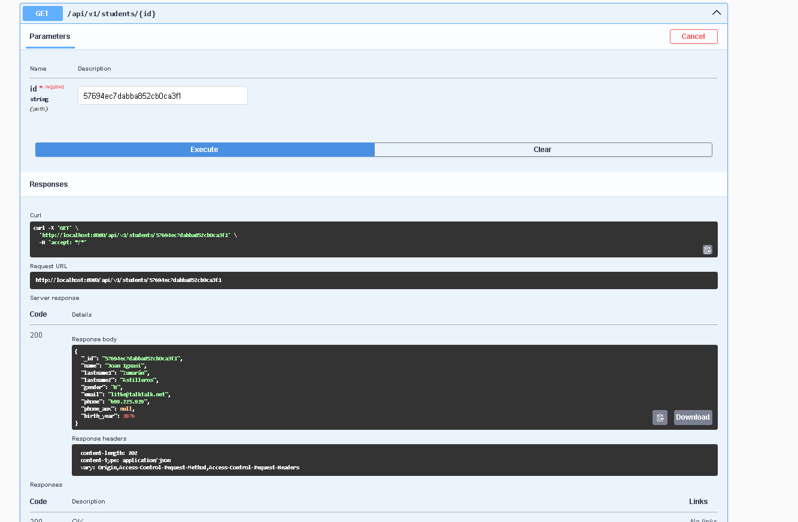
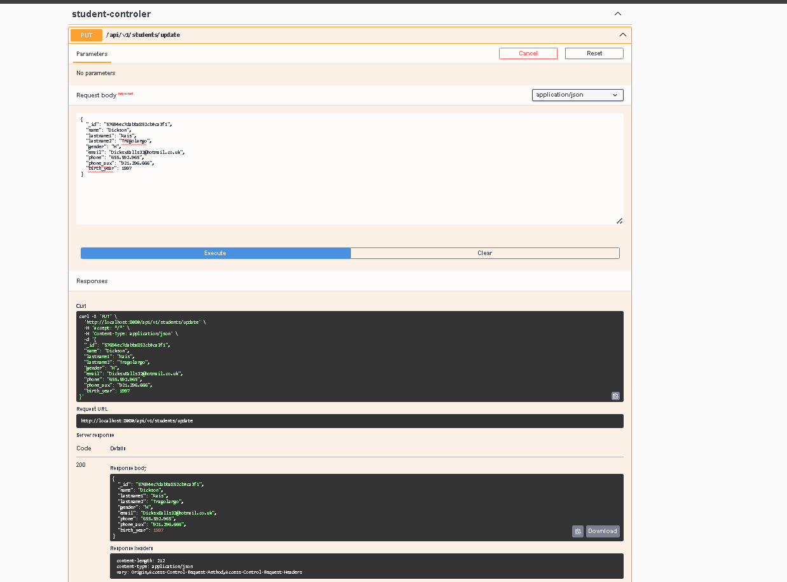
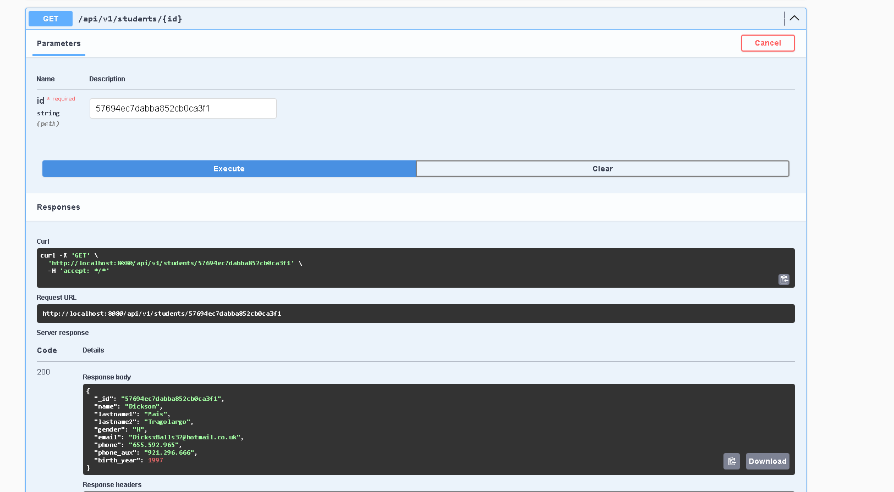
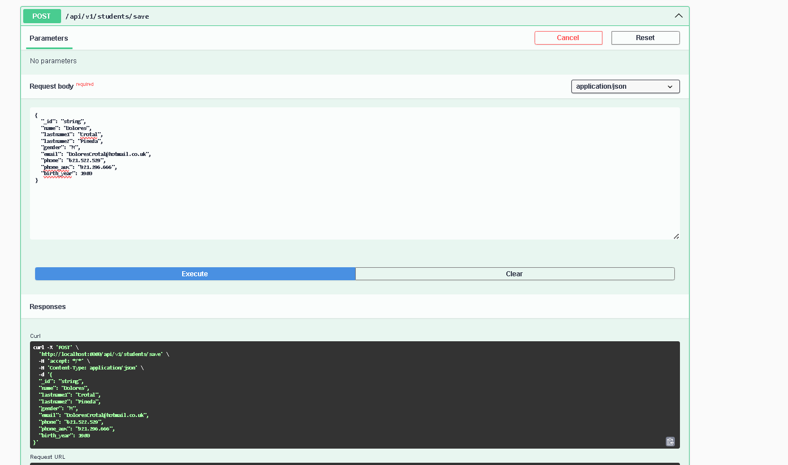
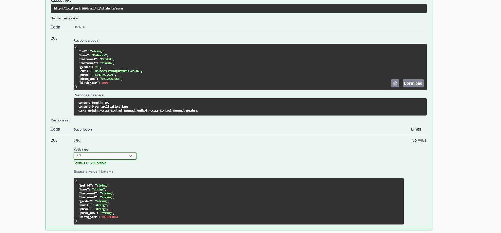
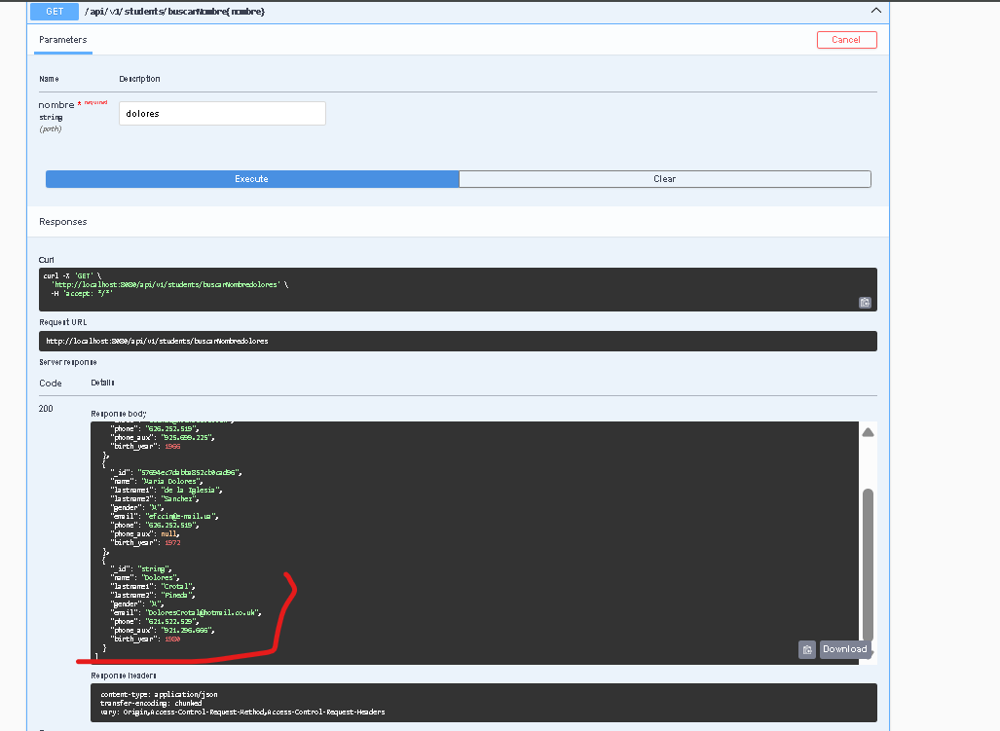
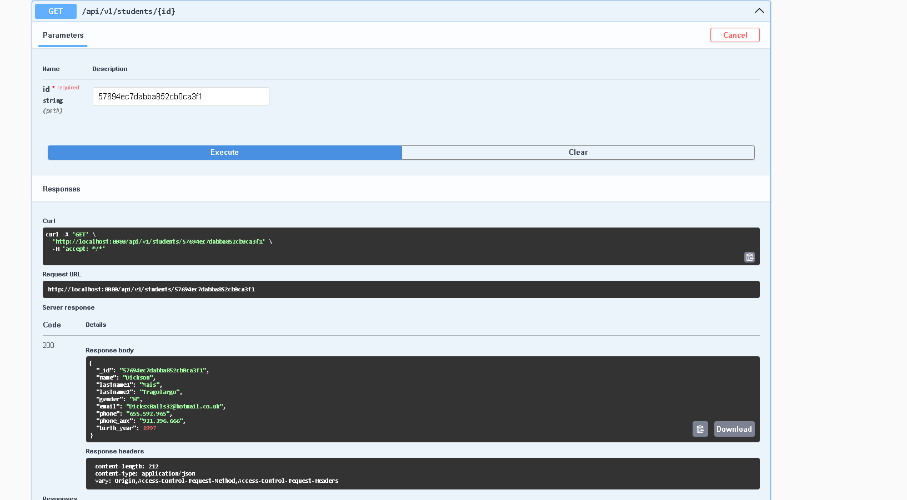
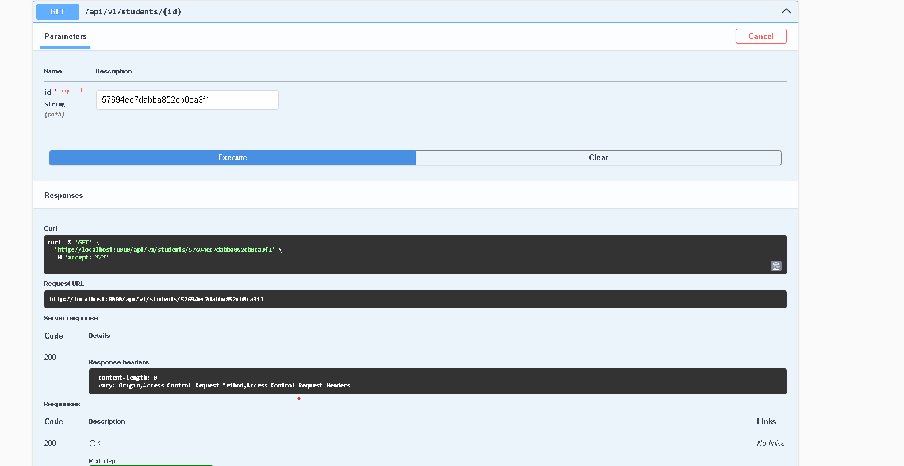
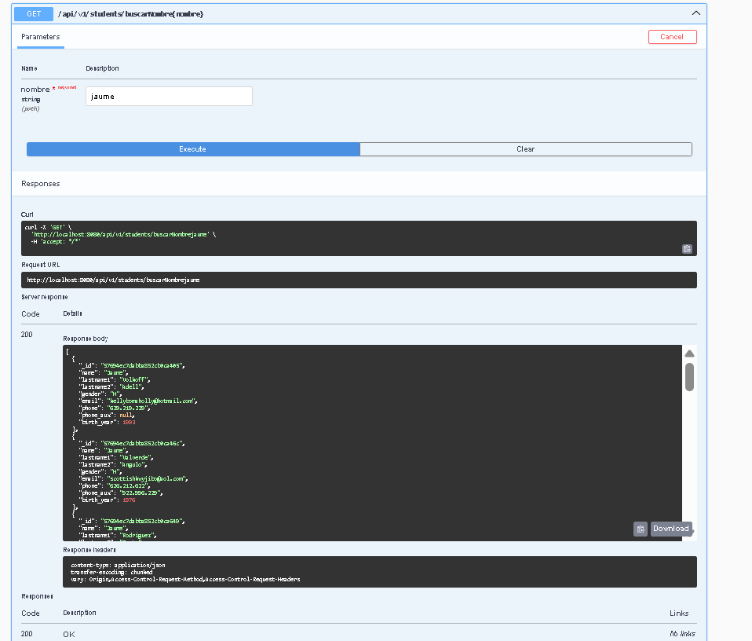
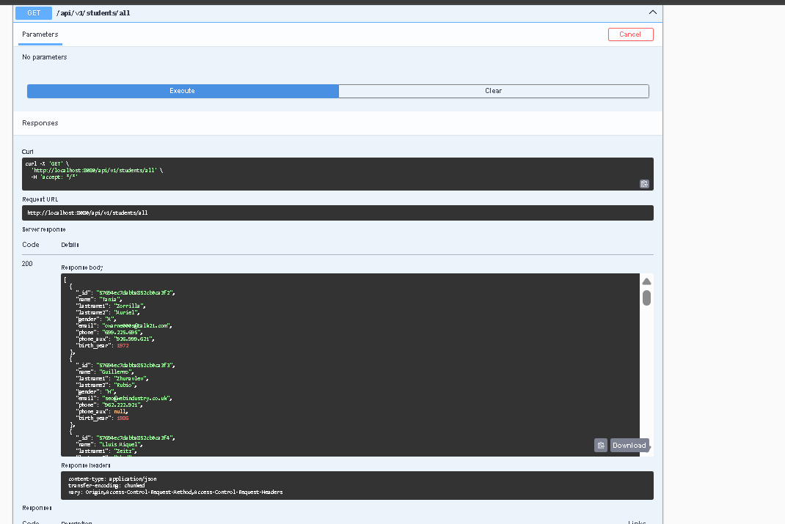

# Activitat-A02-UF3-M06

<h3>Update</h3>
<h5>Antes</h5>

<h5>Actualizando...</h5>

<h5>Después</h5>
  
<h3>Save</h3>
<h5>Guardando...</h5>

<h5>Resultado</h5>
  
<h3>Buscar por id</h3>
  
<h3>Delete</h3>
<h5>Borrando...</h5>

<h5>Resultado</h5>
  
<h3>Buscar estudiante por nombre(regex que permite la búsqueda de un nombre de estudiante, tanto en mayúsculas como en minúsculas.)</h3>
  
<h3>Encontrar todos los estudiantes</h3>
  
<h3>2-Què caracteritza una api reactiva com aquesta i què la fa diferent d’una api síncrona amb MVC com les treballades anteriorment?</h3>

A diferencia de las API que siguen un modelo MVC, las API reactivas son asíncronas, lo que significa que pueden procesar peticiones sin necesidad de esperar a que otras peticiones hayan finalizado. Esto se logra sin bloquear el hilo principal, reaccionando dinámicamente a los cambios en los flujos.
  
<h3>Què signifiquen Mono i Flux? Per a què penseu que serveixen i per què són útils en aquest tipus de programació?</h3>

Se trata de dos clases proporcionadas por la librería Project Reactor, utilizadas para trabajar con operaciones asíncronas sin bloquear el hilo principal. Estas clases pueden manipularse dinámicamente mediante operadores como map, filter, entre otros. Las diferencias entre ellas son las siguientes:

<ul>
<li>Mono: contiene de cero a un único elemento.</li>
<li>Flux: contiene de cero a un número indeterminado de elementos</li>
</ul>
  
<h3>Què és record? Un record utilitza getters i setters? Justifiqueu la resposta.</h3>

Un record es una clase especial en Java cuyos atributos son inmutables una vez definidos. Debido a esta inmutabilidad, no utiliza setters, y proporciona métodos de acceso implícitos de forma automática para cada componente declarado.

